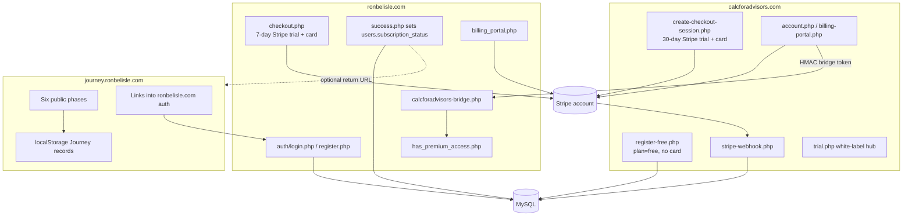

# Journey Premium Architecture Audit

**Status:** Audit only — **not an implementation plan**  
**Date:** 2026-07-25  
**Scope:** Existing production Premium / auth / Stripe infrastructure used by calcforadvisors.com and ronbelisle.com, evaluated for reuse by the Retirement Planning Journey (`journey.ronbelisle.com`)  
**Constraint:** Prefer extending the existing system over building a parallel one  

> No secrets, API keys, webhook secrets, database credentials, or customer data are included in this document.  
> Config values are referenced by constant / env key name only.

---

## Executive summary

The production estate already contains **two related but separate subscription stacks** that share one MySQL database and (typically) one Stripe account:

| Stack | Host | Audience | Trial | Entitlement write path |
|---|---|---|---|---|
| **Consumer Premium** | ronbelisle.com | Household / DIY users | **7-day** Stripe trial (card required) | Checkout success page (`success.php`) |
| **Advisor Premium** | calcforadvisors.com | Advisor white-label | **30-day** Stripe trial (card required) **plus** a separate free non-Stripe 30-day white-label trial | Stripe webhook (`stripe-webhook.php`) |

Journey already has light integration with the **consumer** stack (`auth/login.php`, `auth/register.php?intent=trial`, Journey `return=` handling, `success.php` return CTA). Journey has **no** local Stripe handlers and currently stores plan data in **browser `localStorage` only**.

**Recommendation:** Reuse the **ronbelisle.com consumer authentication + Stripe account + entitlement patterns**. Give Journey its **own Stripe Product and Price(s)** with a **30-day** trial. Do **not** reuse the calcforadvisors white-label / advisor-branding stack as Journey’s primary account model. Extend (do not replace) the consumer stack where Journey needs server-side saved plans and stronger subscription lifecycle sync.

---

## 1. Existing architecture overview

### Primary code locations

| Area | Paths |
|---|---|
| Consumer auth | `auth/login.php`, `auth/register.php`, `auth/logout.php`, `auth/forgot-password.php`, `auth/reset-password.php` |
| Consumer billing | `subscribe.php`, `checkout.php`, `success.php`, `billing_portal.php`, `account.php`, `premium.html` |
| Shared includes | `includes/session_bootstrap.php`, `includes/auth_flow_helpers.php`, `includes/has_premium_access.php`, `includes/stripe_config.php`, `includes/db_config.php`, `includes/password_reset.php` |
| CFA app | `calcforadvisors/` (login, register-free, checkout, webhook, billing portal, trial pages, bridge token) |
| Cross-site bridge | `calcforadvisors-bridge.php` ← `calcforadvisors/get-calc-bridge-token.php` |
| Premium APIs | `api/save_scenario.php`, `api/load_scenarios.php`, `api/delete_scenario.php`, exporters, explain endpoints |
| Journey | `journey.ronbelisle.com/` (no Stripe/auth server yet) |
| Config (external) | `/etc/ronbelisle/config.php` or env via `includes/config_bootstrap.php` |

---

## 2. Authentication architecture

### 2.1 Consumer stack (ronbelisle.com) — preferred Journey base

- **Method:** Email + password (`password_hash` / `password_verify`).
- **No** OAuth, magic-link login, or JWT session model for login.
- **Password reset:** HMAC-signed email token (`includes/password_reset.php`); not a dedicated DB token table.
- **Session bootstrap:** `rb_session_start()` in `includes/session_bootstrap.php`.
- **Cookie policy:**
  - Path `/`
  - **Host-only** (`domain` empty — not `.ronbelisle.com`)
  - `Secure` when HTTPS
  - `HttpOnly`
  - `SameSite=Lax`
  - Optional `rb_remember=1` marker extends session lifetime to 30 days
- **Session keys (after login):** `user_id`, `user_email`, `user_name`, `subscription_status`, optional `remember_me`
- **Auth flow extras:** `redirect_after_login`, `redirect_after_premium`, `auth_intent`, `trial_signup_email`
- **Journey awareness already exists** in `includes/auth_flow_helpers.php`:
  - Allows safe returns to `https://journey.ronbelisle.com/...`
  - Supports `intent=trial` so register → subscribe → checkout → success can run before returning to Journey

### 2.2 Advisor stack (calcforadvisors.com) — not the Journey identity model

- Separate table: `calcforadvisors_subscribers`
- Separate session keys (`calcforadvisors_subscriber_id`, plan, status, …)
- Post-checkout password setup via HMAC email link
- Free signup without Stripe (`register-free.php`)
- White-label firm branding (`firm_name`, `logo_url`, `banner_url`, `trial_slug`)

### 2.3 Answers

**1. How are users authenticated?**  
Email/password PHP sessions on each host. Consumer and advisor identities are **separate tables** and **separate sessions**. No shared parent-domain SSO cookie today.

---

## 3. Subscription architecture

### 3.1 Consumer Premium entitlement

Central gate: `has_premium_access()` (`includes/has_premium_access.php`):

1. Logged-in consumer with `users.subscription_status === 'premium'` → access
2. Else CFA bridge session with plan `monthly` or `annual` → access
3. Else → no access

Consumer activation path:

1. User registers / logs in
2. `checkout.php` creates Stripe Checkout Session (`mode=subscription`)
3. Stripe Checkout collects card and starts trial
4. `success.php` verifies session and runs roughly:  
   `UPDATE users SET subscription_status='premium', stripe_subscription_id=?`

Account management:

- `account.php` → `billing_portal.php` → Stripe Customer Billing Portal
- Cancel / payment-method updates are Portal-driven

### 3.2 CFA paid entitlement

- Checkout via `create-checkout-session.php`
- Webhook upserts `calcforadvisors_subscribers` (`status='active'`, plan monthly/annual)
- Cancel → webhook `customer.subscription.deleted` → `canceled`
- Failed invoice → `past_due`
- Bridge token lets paid CFA users use ronbelisle.com calculator Premium features without a consumer `users` row

### 3.3 Answers

**2. How is Premium membership determined?**  
Primarily DB status (`users.subscription_status` or CFA subscriber plan/status) plus session presence, checked by `has_premium_access()`.

**7. How are Premium permissions enforced?**  
Server-side checks in calculator pages and APIs (`has_premium_access()`, `get_scenario_owner()`). Client JS receives an `isPremiumUser` flag for UI, but save/export/AI endpoints re-check on the server.

---

## 4. Trial architecture

There are **three live “trial” concepts**, plus Journey’s design intent:

| Trial | Where | Length | Card required? | Mechanism |
|---|---|---|---|---|
| Consumer Premium trial | ronbelisle.com Checkout | **7 days** | **Yes** | `subscription_data.trial_period_days = 7` in `checkout.php` |
| CFA paid Subscribe trial | calcforadvisors Checkout | **30 days** | **Yes** | `trial_period_days = 30` in `create-checkout-session.php` |
| CFA free white-label trial | calcforadvisors free signup | **30 days** | **No** | App clock from `created_at`; not a Stripe subscription |
| Journey design target | docs only | **30 days** | TBD in implementation | Not implemented |

### Answers

**3. How is the existing 30-day trial implemented?**  
On **calcforadvisors paid Checkout**, as Stripe `trial_period_days: 30`. Separately, CFA free signup uses a non-Stripe 30-day white-label window. Consumer Premium uses **7 days**, not 30.

**4. Does the current trial require a payment method?**  
- Stripe trials (consumer 7-day and CFA paid 30-day): **yes** — Checkout uses `payment_method_types: ['card']`.  
- CFA free white-label 30-day: **no card**.

**Journey implication:** The Journey product wants a **30-day** trial. That length already exists in the CFA Checkout pattern and can be applied to a **new Journey Price** on the consumer checkout pattern. It is **not** currently the consumer Premium default (7 days). Reuse the **Stripe trial mechanism**, not the CFA free white-label clock, unless a deliberate no-card trial is chosen later.

---

## 5. Stripe architecture

### 5.1 Objects in use

| Stripe object | Consumer (ronbelisle.com) | CFA (calcforadvisors.com) |
|---|---|---|
| Checkout Session | `checkout.php` | `create-checkout-session.php` |
| Subscription | Created by Checkout; id on `users.stripe_subscription_id` | Id on `calcforadvisors_subscribers.stripe_subscription_id` |
| Customer | Created/attached by Checkout; portal resolves via Subscription | `stripe_customer_id` from webhook |
| Customer Portal | `billing_portal.php` | `billing-portal.php` |
| Product / Price | Config: `STRIPE_PRICE_MONTHLY`, `STRIPE_PRICE_ANNUAL` | Config: `CALCFORADVISORS_PRICE_MONTHLY`, `CALCFORADVISORS_PRICE_ANNUAL` |
| Webhook Event | **No dedicated consumer webhook in repo** | `calcforadvisors/stripe-webhook.php` |

Config loader: `includes/stripe_config.php` (constants from external config / env; **no secrets in git**).

### 5.2 Webhook events (CFA only today)

Handled in `calcforadvisors/stripe-webhook.php`:

- `checkout.session.completed` → create/update CFA subscriber; welcome / set-password email
- `customer.subscription.deleted` → `canceled`
- `invoice.payment_failed` → `past_due`

Not handled as first-class lifecycle events today:

- `customer.subscription.updated` / trial end transitions
- Invoice paid / renewal confirmation
- **Consumer Premium cancel / past_due auto-downgrade**

### 5.3 Answers

**5. Which Stripe objects are being used?**  
Checkout Session, Subscription, Customer, Customer Portal, Product/Price (via configured Price IDs). Webhooks exist for CFA; consumer Premium is success-page activated.

**6. How are trial expiration, cancellation, renewal, and failed payments handled?**

| Event | CFA paid | Consumer Premium |
|---|---|---|
| Trial ends → first charge | Stripe Subscription continues; DB remains `active` / `premium` unless payment fails | Stripe charges; DB remains `premium` unless manually changed |
| Cancel | Portal + webhook → `canceled` | Portal cancel works in Stripe; **DB may remain `premium`** (no consumer cancel webhook) |
| Renewal | Stripe renews; no special webhook needed while status stays active | Stripe renews; DB stays `premium` |
| Failed payment | Webhook → `past_due` | **No automatic DB downgrade in repo** |

This consumer webhook gap is a known risk to fix before/while Journey depends on the same entitlement model.

---

## 6. Saved-data architecture

| Store | Owner | Contents |
|---|---|---|
| `users` | Consumer | Identity, `subscription_status`, `stripe_subscription_id` |
| `scenarios` | Consumer Premium | Named calculator scenarios (JSON) keyed by `user_id` |
| `calcforadvisors_subscribers` | Advisors | Identity, Stripe ids, branding, free/paid plan |
| `calcforadvisors_scenarios` | Paid CFA | Advisor scenario saves |
| Budget tables | Premium-gated tools | Budget feature data |
| Journey records | Browser only today | `localStorage` key `rbJourneyProgressV1` via `journey-progress.js` / `journey-records.js` |

**8. Where are user-specific saved records stored?**  
Calculator Premium saves are MySQL (`scenarios` / `calcforadvisors_scenarios`). Journey plans are **not yet server-persisted**.

**Journey need:** A Journey-specific persistence layer (new table(s) or carefully namespaced records) owned by `users.id`, plus an import path from browser localStorage after login/trial start.

---

## 7. Cross-subdomain / session architecture

### Current reality

- Sessions are **host-scoped** (`domain=''`).
- `journey.ronbelisle.com` and `ronbelisle.com` do **not** share `PHPSESSID`.
- CFA ↔ ronbelisle Premium uses an **HMAC redirect bridge**, not cookie SSO.
- Journey ↔ ronbelisle already uses **safe return URLs** and optional post-checkout return to Journey.

### Feasibility for Journey

Cross-subdomain authentication is **feasible**, with two practical patterns:

1. **Recommended near-term (extends what already works):**  
   Keep auth/checkout on `ronbelisle.com`; Journey deep-links with `return=` / `intent=trial`; after success, return to Journey. Optionally issue a short-lived signed “Journey session bootstrap” token analogous to the CFA bridge if Journey needs a logged-in server API on the Journey host.

2. **Later true SSO:**  
   Set session cookie `domain=.ronbelisle.com` (and align CSRF/SameSite carefully). This is a broader change affecting all ronbelisle.com session consumers and should not be the first milestone.

**Cross-subdomain auth appears feasible** without a greenfield auth system. Prefer return-URL + shared consumer account first; parent-domain cookies only if Journey APIs on the Journey host require ambient session.

---

## 8. Components that should be reused unchanged

- Stripe account and Composer Stripe SDK (`vendor/`)
- Externalized secrets pattern (`config_bootstrap.php` / `/etc/ronbelisle/config.php` / env)
- Consumer email/password auth (`auth/*`)
- Session bootstrap + remember-me cookie policy (initially host-scoped)
- Auth redirect helpers that already understand Journey returns (`auth_flow_helpers.php`)
- Stripe Checkout Session + Customer Portal pattern
- `account.php` / billing portal conceptual UX
- Principle of server-side entitlement checks (never trust client flags alone)
- Existing MySQL connectivity and user identity (`users`)

---

## 9. Components that should be adapted

| Component | Adaptation for Journey |
|---|---|
| Checkout trial length | New Journey Price(s) with **30-day** trial (do not silently reuse 7-day consumer Price) |
| Entitlement model | Extend beyond binary calculator Premium if Journey needs product-scoped access (`journey_premium` vs calculator Premium) — or intentionally unify “one Premium” across properties |
| `success.php` | Ensure Journey return + Journey entitlement write are reliable; ideally add webhook-backed sync |
| Webhooks | Add consumer/Journey lifecycle handling (cancel, past_due, maybe `customer.subscription.updated`) or generalize CFA webhook into a shared Stripe event router keyed by Price ID |
| `has_premium_access()` | Either teach it Journey entitlement, or add a sibling `has_journey_premium_access()` used by Journey APIs |
| Saved data APIs | New Journey save/load/import endpoints; do not overload calculator `scenarios` blindly |
| Transition UX | Implement Journey Free→Premium coaching page per product docs; remove conflicting 7-day Journey invitations when that work lands |
| Pricing copy helpers | `get_premium_pricing_blurb()` currently hardcodes 7-day consumer copy — Journey must not inherit that text by accident |

---

## 10. Components that should remain Journey-specific

- Six-phase Journey UX, engines, and local progress model
- Journey-completion / continuity coaching copy
- Journey server persistence schema (plan snapshots, alternatives, revision history)
- localStorage → account import flow
- Journey Premium value proposition (continuity of the household plan), distinct from calculator save/export/AI and CFA white-label branding
- Journey-owned Stripe Product/Price naming and metadata (`product=journey` or similar)
- Any Journey-only dashboard surfaces for plan history / alternatives

**Do not reuse as Journey’s primary model:**

- `calcforadvisors_subscribers` white-label fields
- CFA free no-card trial as the default paid-conversion path (unless product later chooses no-card)
- CFA bridge as the main Journey login mechanism

---

## 11. Risks

1. **Consumer Premium has no cancel/past_due webhook** — canceled Stripe subscriptions can remain `subscription_status='premium'`. Journey must not inherit this gap unnoticed.
2. **Trial-length collision** — consumer is 7-day; Journey wants 30-day; CFA paid is already 30-day. Mixing Prices or copy will confuse users.
3. **Product-scope ambiguity** — one `users.subscription_status='premium'` currently means calculator Premium. Journey may need either unified Premium or explicit product flags.
4. **Host-scoped sessions** — Journey pages cannot see ronbelisle.com login cookies without a bridge/return pattern or cookie-domain change.
5. **localStorage migration** — importing browser plans into accounts needs idempotent merge rules and stale-snapshot handling.
6. **Docs drift** — older docs still mention incomplete webhook coverage / older pricing; `FREE_TO_PREMIUM_TRANSITION.md` still describes Phases 4–6 as Premium-gated even though those phases are now publicly open. Product decision for gating vs continuity-only Premium should be confirmed before implementation.
7. **Webhook routing** — CFA webhook currently filters by CFA Price IDs / success URL. A shared Stripe account needs clean Price-based routing so Journey events do not create CFA subscriber rows (and vice versa).

---

## 12. Recommended implementation order

1. **Product decision lock**  
   Confirm Journey Premium is continuity-first (save/revisit/compare) and whether it shares “one Premium” with calculators or is a distinct entitlement.

2. **Stripe catalog**  
   Create Journey Product + monthly/annual Prices with **30-day trial** in the existing Stripe account. Add config keys alongside existing Price constants (do not overwrite CFA/consumer Prices).

3. **Entitlement + webhook hardening**  
   Extend subscription status sync for consumer/Journey (cancel, past_due at minimum). Route webhook events by Price ID.

4. **Auth reuse for Journey**  
   Keep accounts on ronbelisle.com consumer auth; Journey CTAs use register/login + return URLs (already partially built).

5. **Checkout path for Journey**  
   Adapt consumer Checkout flow to select Journey Prices and 30-day trial copy; return users to Journey after success.

6. **Server-side Journey persistence**  
   Save authenticated Journey records; keep free localStorage Journey working offline/anonymous.

7. **Import bridge**  
   One-time/local merge of `rbJourneyProgressV1` into the authenticated Journey record after trial/login.

8. **Journey Premium UX**  
   Continuity workspace / transition page; still no need for a parallel auth platform.

---

## Compatibility with Journey requirements

| Journey requirement | Existing fit | Notes |
|---|---|---|
| Create an account | **Reuse consumer auth** | Already linked from Journey in places |
| Start a 30-day trial | **Reuse Stripe trial mechanism** | Need Journey Price with 30 days; do not reuse 7-day consumer Price |
| Save Journey / return later | **Adapt** | Need server persistence; localStorage remains free path |
| Revise assumptions / compare alternatives | **Journey-specific** | Build on Journey records, not calculator scenarios |
| Free Journey stays useful | **Compatible** | Keep phases free; Premium = continuity |
| Import browser work into account | **New** | Not built; should be an early Premium milestone |
| Avoid new auth/subscription platform | **Supported** | No compelling reason to rebuild auth/Stripe from scratch |

---

## Direct answers (audit questions 9–11)

**9. Can Journey reuse the same authentication and subscription framework?**  
**Yes.** Reuse ronbelisle.com consumer auth + the shared Stripe account + Checkout/Portal patterns. Extend entitlement sync and add Journey Prices/persistence.

**10. Which parts should definitely be reused?**  
Consumer auth, session helpers, Stripe account/SDK, Checkout + Customer Portal, externalized config, MySQL `users` identity, Journey return-URL helpers, server-side entitlement checking discipline.

**11. Which parts should remain independent for Journey?**  
Journey UX/engines, Journey persistence schema, Journey Product/Price, continuity workspace, localStorage import rules, Journey-specific messaging. CFA white-label stack stays advisor-specific.

---

## Final recommendation snapshot

| Question | Answer |
|---|---|
| What can Journey reuse? | Consumer auth, Stripe account, Checkout/Portal, config/secrets pattern, `users` identity, existing Journey return-flow helpers |
| Can the current 30-day trial be reused? | **Reuse the Stripe 30-day trial pattern** (already proven on CFA paid Checkout). Do **not** reuse the consumer 7-day Price. Optionally study CFA free no-card trial only if product later wants no payment method. |
| Own Stripe Product/Price, shared account? | **Yes.** Journey should have its own Product/Price(s) in the **same** Stripe account, with metadata/Price-ID routing in webhooks. |
| Cross-subdomain auth feasible? | **Yes**, via existing return-URL / post-checkout return (near term). Parent-domain cookies are optional later. |
| Biggest technical risk | Consumer entitlement drift without webhooks (cancel/past_due), plus trial-length / product-scope confusion across 7-day vs 30-day Prices |
| Recommended first implementation milestone | **Create Journey Stripe Product/Price (30-day trial) + webhook/entitlement sync design for consumer/Journey Price IDs**, while keeping Journey free phases unchanged and still localStorage-first until save APIs land |

---

## Out of scope (explicit)

This audit does **not**:

- Implement authentication, Stripe, trials, or gating
- Change production behavior
- Choose final Journey pricing
- Redesign CFA white-label
- Replace the existing auth system

Next workstream after review: Journey Premium transition design that **extends** this architecture rather than inventing a parallel one.
